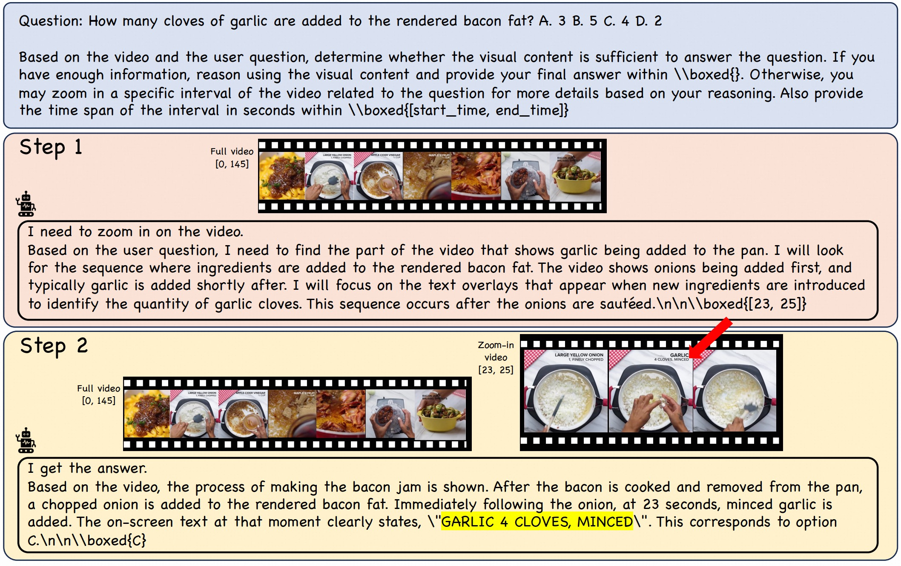
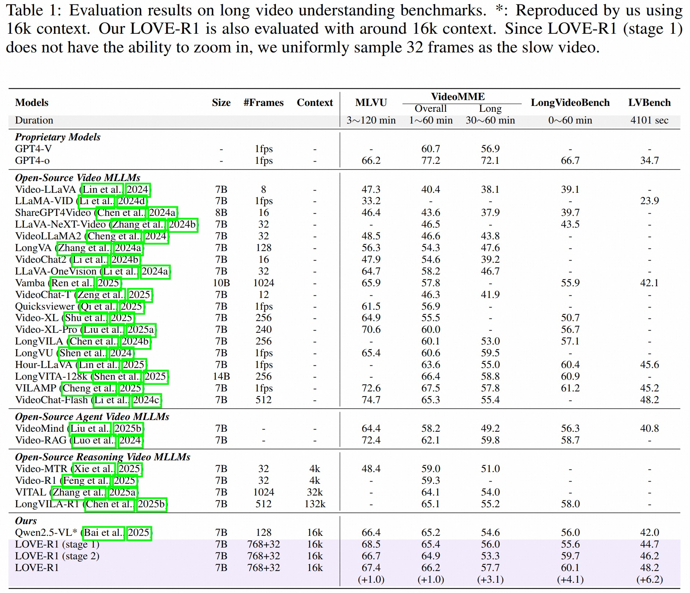

# LOVE-R1: Advancing Long Video Understanding with Adaptive Zoom-in Mechanism via Multi-Step Reasoning

[paper link](https://arxiv.org/abs/2509.24786)
## 👀 LOVE-R1 Overview

<p align="center">
    
</p>

Long video understanding is still challenging for recent Large Video-Language Models (LVLMs) due to the conflict between long-form temporal understanding and detailed spatial perception. LVLMs with a uniform frame sampling mechanism, which samples frames with an equal frame size and fixed sampling rate, inevitably sacrifice either temporal clues or spatial details, resulting in suboptimal solutions. To mitigate this dilemma, we propose LOVE-R1, a model that can adaptively zoom in on a video clip. The model is first provided with densely sampled frames but in a small resolution. If some spatial details are needed, the model can zoom in on a clip of interest with a large frame resolution based on its reasoning until key visual information is obtained. The whole process is implemented as a multi-step reasoning process. To train the reasoning ability, we first finetune the model on our collected 38k high-quality CoT data and enhance it with decoupled reinforcement finetuning. As outcome rewards can not provide fine-grained process supervision, we decouple multi-step reasoning into multiple single-step reasoning and optimize the internal zoom-in ability explicitly. Experiments on long video understanding benchmarks show that our model with the slow-fast adaptive frame sampling mechanism achieves a great trade-off between sampling density and frame resolutions, and LOVE-R1 outperforms our baseline Qwen2.5-VL by an average of 3.1% points across 4 common long video understanding benchmarks.

## 📈 Experimental Results

#### 📍 Model Zoo

- We provide our checkpoints at [Huggingface](https://huggingface.co/collections/iSEE-Laboratory/love-r1)
    - [love-r1-stage1](https://huggingface.co/iSEE-Laboratory/love-r1-stage1)
    - [love-r1-stage2](https://huggingface.co/iSEE-Laboratory/love-r1-stage2)
    - [love-r1-stage3](https://huggingface.co/iSEE-Laboratory/love-r1-stage3)


#### 📍 Results

<p align="center">
    
</p>

## ⭐ Training

#### Our environment

```
pytorch==2.5.1+cu124
transformers==4.49.0
trl==0.17.0
```

- You can also setup the environment by running `bash setup.sh`.

#### Data Preparation

- To reproduce the 3 stage fine-tuning, users should download the following datasets:

  - `annotations` can be found in our [Huggingface](https://huggingface.co/collections/iSEE-Laboratory/love-r1). (You should modify the path in them.)

  - `finevideo`: https://huggingface.co/datasets/HuggingFaceFV/finevideo

  - `LLaVA-Video-178k`: https://huggingface.co/datasets/lmms-lab/LLaVA-Video-178K

  - `ET-Instruct`: https://huggingface.co/datasets/PolyU-ChenLab/ET-Instruct-164K

  - `Next-GQA`: https://huggingface.co/datasets/jinyoungkim/NExT-GQA

  - `CG-Bench`: https://huggingface.co/datasets/CG-Bench/CG-Bench
  - `MoiveChat`: https://huggingface.co/datasets/Enxin/MovieChat-1K_train 


### Training

- The training can be conducted on 8 A800 GPUs. 
  - If you do not have enough memory, you can also use L20. But you should modify the number of frames in `sft_video.py` and `grpo_trainer.py`
  - Note, the training context length will greatly affect the performance.
- The training scripts are in `src/scripts`.

## 📏Evaluating on MLLM Benchmarks

**Note**: we find that the performance varies across different environment and machines.

- For example, we find that the performance gap between the L20 and A800 is up to 0.5. And we test our model on L20.

#### 📍 Stage 1

- Modify the model path of `Qwen2.5-VL-7B-Instruct` in `VLMEvalKit/vlmeval/config.py`

```
"Qwen2.5-VL-7B-Instruct": partial(
        Qwen2VLChat,
        model_path="YOUR_PATH",
        # min_pixels=1280 * 28 * 28,
        # max_pixels=16384 * 28 * 28,
        use_custom_prompt=False,
    ),
```

- Then, modify the dataset path of each file in `VLMEvalKit/vlmeval/dataset`
- Finally, evaluate on benchmarks:

```
cd VLMEvalKit

# Video-MME
torchrun --nproc-per-node=8 --nnodes=1 --node_rank=0 --master_addr="127.0.0.1" run.py --data Video-MME_128frame --model Qwen2.5-VL-7B-Instruct

# LVBench
torchrun --nproc-per-node=8 --nnodes=1 --node_rank=0 --master_addr="127.0.0.1" run.py --data LVBench_128frame --model Qwen2.5-VL-7B-Instruct

# MLVU_MCQ
torchrun --nproc-per-node=8 --nnodes=1 --node_rank=0 --master_addr="127.0.0.1" run.py --data MLVU_MCQ_128frame --model Qwen2.5-VL-7B-Instruct

# LongVideoBench
torchrun --nproc-per-node=8 --nnodes=1 --node_rank=0 --master_addr="127.0.0.1" run.py --data LongVideoBench_128frame --model Qwen2.5-VL-7B-Instruct

# MVBench
torchrun --nproc-per-node=8 --nnodes=1 --node_rank=0 --master_addr="127.0.0.1" run.py --data MVBench_128frame --model Qwen2.5-VL-7B-Instruct
```

#### 📍 Stage 2 & 3

- Modify the model path of `Qwen2.5-VL-7B-Instruct-Sample-Frame` in `VLMEvalKit/vlmeval/config.py`

```
"Qwen2.5-VL-7B-Instruct-Sample-Frame": partial(
        Qwen2VLChatSampleFrame,
        model_path="YOUR_PATH",
        # min_pixels=1280 * 28 * 28,
        # max_pixels=16384 * 28 * 28,
        use_custom_prompt=False,
    ),
```

- Then, modify the dataset path of each file in `VLMEvalKit/vlmeval/dataset`
- Finally, evaluate on benchmarks:

```
cd VLMEvalKit

# Video-MME
torchrun --nproc-per-node=8 --nnodes=1 --node_rank=0 --master_addr="127.0.0.1" run.py --data Video-MME_128frame --model Qwen2.5-VL-7B-Instruct-Sample-Frame

# LVBench
torchrun --nproc-per-node=8 --nnodes=1 --node_rank=0 --master_addr="127.0.0.1" run.py --data LVBench_128frame --model Qwen2.5-VL-7B-Instruct-Sample-Frame

# MLVU_MCQ
torchrun --nproc-per-node=8 --nnodes=1 --node_rank=0 --master_addr="127.0.0.1" run.py --data MLVU_MCQ_128frame --model Qwen2.5-VL-7B-Instruct-Sample-Frame

# LongVideoBench
torchrun --nproc-per-node=8 --nnodes=1 --node_rank=0 --master_addr="127.0.0.1" run.py --data LongVideoBench_128frame --model Qwen2.5-VL-7B-Instruct-Sample-Frame

# MVBench
torchrun --nproc-per-node=8 --nnodes=1 --node_rank=0 --master_addr="127.0.0.1" run.py --data MVBench_128frame --model Qwen2.5-VL-7B-Instruct-Sample-Frame
```

### ✒️ Citation

If you find our work helpful for your research, please consider citing our work.   

```bibtex
@article{fu2025lover1,
  title={LOVE-R1: Advancing Long Video Understanding with an Adaptive Zoom-in Mechanism via Multi-Step Reasoning},
  author={Fu, Shenghao and Yang, Qize and Li, Yuan-Ming and Wei, Xihan and Xie, Xiaohua and Zheng, Wei-Shi},
  journal={arXiv preprint arXiv:2509.24786},
  year={2025}
}
```

## 📜 License

- Our models and code are under the Apache License 2.0. Our data is under MIT License.

